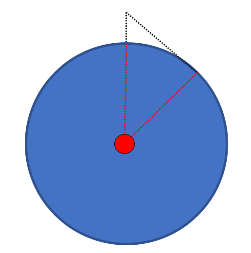

# 欲穷千里目，更上一层楼

### 问题提出

- 根据你的身高，确定能够看到多远的地平线？

- 如果要看到千里，需要站在多高的地方？

### 模型建立

地球是一个球体，我们站在地球上观看远处的地点。能看到的最远的距离是我们视线和地球球面相切的地方。如下图所示：



所以我们的问题就是要找到我们视线和地球的切点，然后计算出地球的弧线长度。

### 程序

```cpp
#include <iostream>
#include <cmath>
using namespace std;

int main() {
	double height = 1.87;
	double radius = 6371000;
	double angle = acos((double)radius / (height + radius));
	double distance = radius * angle;
	cout << distance << "m" << endl;

	int distanceThousandMile = 1000000;
	angle = (double)distanceThousandMile / radius;
	height = radius / cos(angle) - radius;
	cout << height << "m" << endl;

	return 0;
}
```

### 计算结果

```cpp
4881.35m
79294.4m 
```

---

### 后来的备注

需要注意**千里**实际上是`1000*500m`。

原来题目的解答中使用的是**一千公里**。