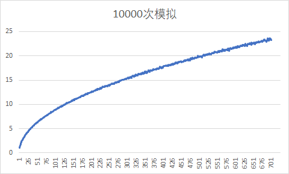
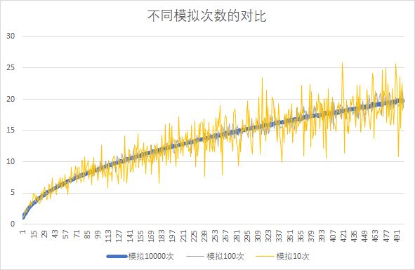

# CS125-第二次OC作业

### 题目

一名醉汉每次在前后左右四个方向中随机选择一个方向走一米，请问走了n步之后该醉汉离出发位置有多远？注：由于每次走的路径都不相同，因此每次走了n步后离出发位置的距离可能不相同，因此需要模拟m次，然后求出这m次的平均值。请利用Excel或其它软件绘制图，横坐标为步数n ，纵坐标为平均距离。

### 分析

- 对于随机行走，我们使用随机数来模拟。

- 对于每次行走的位置改变，我们使用改变`(x,y)`坐标来处理。

### 基础代码

使用`srand(time(NULL))`对随机数种子初始化。

使用`long double`确保数据肯定不会溢出。

```cpp
#include <iostream>
#include<ctime>
#include <algorithm>
using namespace std;

int main() {
	srand(time(NULL));
	int m, n;
	cout << "请输入模拟的次数m: "; cin >> m;
	cout << "请输入每次模拟的步数n: "; cin >> n;

	long double total = 0;
	for (int i = 0; i < m; i++) {
		int x = 0, y = 0;
		for (int j = 0; j < n; j++) {
			int op = rand() * 4 / (RAND_MAX + 1);
			switch (op) {
			case 0:x++;break;
			case 1:x--;break;
			case 2:y++;break;
			case 3:y--;break;
			}
		}
		total += sqrt(pow(x, 2) + pow(y, 2));
	}
	cout << "对于模拟 " << m << " 次，每次 " << n << " 步的情况: 离出发位置 " << total / m << " m 远。" << endl;
	return 0;
}
```

### 基础代码对应的输入输出

```
请输入模拟的次数m: 10000
请输入每次模拟的步数n: 100000
对于模拟 10000 次，每次 100000 步的情况: 离出发位置 280.107 m 远。
```

### 程序改进

1. 对于大数据量的计算机计算过程，我们很难判断计算到什么位置。所以可以通过在代码里面增加`现在模拟的次数`的输出。
2. 对于我们作图想要多组数据而言，我们每次都是手动输入模拟的步数相对来说较为繁琐，如果使用数组来保存，一次输入就可以计算，可以节约大量的时间。

```cpp
#include <iostream>
#include<ctime>
#include <algorithm>
using namespace std;

int main() {
	srand(time(NULL));
	int m = 10000;
//	int arr[] = { 1,10,100,1000,10000,100000,1000000 };

//	for (int k = 0; k < sizeof(arr) / sizeof(*arr); k++) {
	for (int k = 0; k < 500; k++) {
		int currValue = k + 1;
		long double total = 0;
		for (int i = 0; i < m; i++) {
			int x = 0, y = 0;
			for (int j = 0; j < currValue; j++) {
				int op = rand() * 4 / (RAND_MAX + 1);
				switch (op) {
				case 0:x++; break;
				case 1:x--; break;
				case 2:y++; break;
				case 3:y--; break;
				}
			}
			total += sqrt(pow(x, 2) + pow(y, 2));
		}
		cout << total / m << endl;
	}

	return 0;
}
```

### 可视化

1. 对于10000次模拟来说，整体数据呈现一个比较平滑的上升趋势。



2. 对于不同的模拟次数来说，模拟的次数越小，数据的波动越明显。




### 分析

醉汉随机行走问题是一种随机问题。

研究随机问题的数学解需要更多概率论的知识。


### 总结

在研究过程中，也了解了一些概率论的知识：马尔可夫过程等。

除了概率论，我觉得计算机是一种很高效的方式进行数值模拟。

我们人类对于一个未知的问题，可能会很难直接想到背后对应的数学表达。但是对于计算机，正确的编程可以给出一个对应的`值`的结果。这样的结果，无疑对我们之后的数学理论上的分析会有很大的帮助。

同时实践过程中也发现，对于计算机模拟，我们应当适当增加模拟的次数，这样计算出来的平均值会更加贴近‘实际’的情况。

