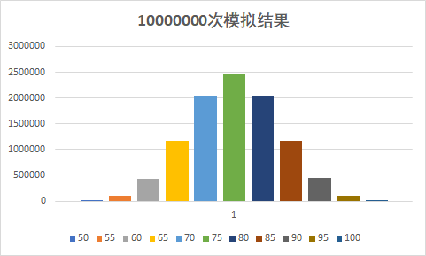

# CS125-第三次OC作业

517030910294 刘瀚文

### 问题

假设抛硬币时正面得10分，反面得5分。一次抛10枚硬币，则总得分从50到100共11种情况。重复此过程，则这11种情况会随机出现，统计这11种情况出现的次数，并用excel等软件绘图，看看是怎样的曲线。在 Canvas 上用`word/pdf`提交源代码和作出的图片。

### 代码

```cpp
#include<iostream>
#include<ctime>
using namespace std;

int main() {
	int times[11] = { 0 };
	int n;

	srand(time(NULL));
	cout << "请输入您想测试的次数(建议较大数值): "; cin >> n;
	for (int i = 0; i < n; i++) {
		int sum = 0, num = 0;
		for (int j = 0; j < 10; j++) {
			num = rand() * 100 / (RAND_MAX + 1) + 1;
			if (num <= 50) { sum += 10; }
			else { sum += 5; }
		}
		times[sum / 5 - 10]++;
	}
	cout << "下面是从 50 到 100 的 11 个值: " << endl;
	for (int i = 0; i < 11; i++) {
		cout << times[i] << ' ';
	}
	return 0;
}
```

### 结果

**10000次模拟**

```
请输入您想测试的次数(建议较大数值): 10000                                      
下面是从 50 到 100 的 11 个值:                                              
11 97 427 1150 2061 2527 2051 1143 440 83 10  
```

**10000000次模拟**

```
请输入您想测试的次数(建议较大数值): 10000000                                  
下面是从 50 到 100 的 11 个值:                                               
9725 97523 439024 1171717 2051611 2461019 2049243 1172958 440122 97503 9555
```

### 结果可视化



