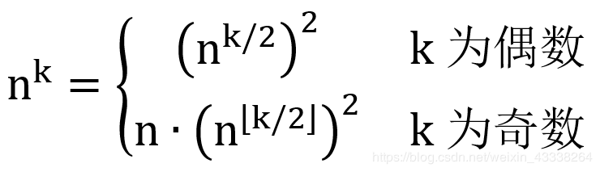

# OJ Contest 5

训练题目内容对应书上第六章。

---

### 1. 完全数

> 编写函数`perfectnum(int x)`判断`x`是否为完全数。
>
> 完全数是指一个数除了自身的所有因子之和恰好等于本身。

[My Code](https://github.com/david990917/My-Computer-Science-Learning/tree/master/Courses/CPP-Programming-Course/OJ%20Contest%205/%E5%AE%8C%E5%85%A8%E6%95%B0.cpp)

1. 函数中要把功能实现完全，这样的话满足函数的功能（相对比不要在主函数中再添加额外的判断）
2. 找因数的时候，注意 `i*i<n` 这样的话可以减少很多的重复计算和重复情况的排除代码。

### 2. Strstr

> 编写函数实现字符串函数strstr的功能

[My Code](https://github.com/david990917/My-Computer-Science-Learning/tree/master/Courses/CPP-Programming-Course/OJ%20Contest%205/strstr.cpp)

容易实现的功能。注意索引的变化。

下面是标准的 Code [直接返回开始的首位置]

```cpp
const char* strstr(const char* src, const char* sub)
{
    const char *bp;
    const char *sp;
    if(!src || !sub)
    {
        return src;
    }
    /* 遍历src字符串  */
    while(*src)
    {
        /* 用来遍历子串 */
        bp = src;
        sp = sub;
        do
        {
            if(!*sp)  /*到了sub的结束位置，返回src位置   */
                return src;
        }while(*bp++ == *sp ++);
        src ++;
    }
    return NULL;
}
```

### 3. 集合操作

> 1）增加一个元素：+
>
> 2）查找一个元素：?
>
> 3）求交集：&
>
> 4）求并集：|

[My Code](https://github.com/david990917/My-Computer-Science-Learning/tree/master/Courses/CPP-Programming-Course/OJ%20Contest%205/%E9%9B%86%E5%90%88.cpp)

首先设计一个集合处理函数`set_process()`：将数组处理成集合。

后续的集合操作，基于`sort`排序函数和上面的集合处理函数就可以很轻松的完成。

```cpp
#include<iostream>
#include<algorithm>
using namespace std;

int set_process(int arr[], int n) {
	int* temp = new int[n];
	int length = 0;

	for (int i = 0; i < n; i++) {
		int j = i + 1;
		for (; j < n; j++) {
			if (arr[j] == arr[i]) { break; }
		}
		if (j == n) {
			temp[length++] = arr[i];
		}
	}
	for (int i = 0; i < length; i++) { arr[i] = temp[i]; }
	delete[] temp;
	return length;
}

void Add(int set[], int n, int num) {
	/* Add num into set, then print the set.*/
	int length = set_process(set, n);
	int i = 0;
	for (; i < length; i++) {
		if (set[i] == num) {
			break;
		}
	}
	if (i == length) {
		set[length++] = num;
	}

	sort(set, set + length);
	for (int i = 0; i < length; i++) {
		cout << set[i] << (i == length - 1 ? '\n' : ' ');
	}
}

void Find(int set[], int n, int num) {
	/* Find num in set, if found, print 1, else print 0.*/
	int length = set_process(set, n);
	int i = 0;
	for (; i < length; i++) {
		if (set[i] == num) {
			break;
		}
	}
	cout << (i == length ? 0 : 1);
}

void Intersection(int set1[], int n, int set2[], int m) {
	/* Get the intersection of set1 and set2, then print the result.*/
	int length1 = set_process(set1, n);
	int length2 = set_process(set2, m);

	sort(set1, set1 + length1);
	sort(set2, set2 + length2);

	int num;
	bool flag = false;
	for (int i = 0; i < length1; i++) {
		num = set1[i];
		for (int j = 0; j < length2; j++) {
			if (num == set2[j]) {
				cout << num << ' ';
				flag = true;
				break;
			}
		}
	}
	if (!flag) { cout << "NoOutput" << endl; }
}

void Union(int set1[], int n, int set2[], int m) {
	/* Get the union of set1 and set2, then print the result.*/
	int length1 = set_process(set1, n);
	int length2 = set_process(set2, m);

	int* temp = new int[length1 + length2];
	for (int i = 0; i < length1; i++) { temp[i] = set1[i]; }
	for (int i = 0; i < length2; i++) { temp[i + length1] = set2[i]; }
	int length = set_process(temp, length1 + length2);

	sort(temp, temp + length);
	for (int i = 0; i < length; i++) { cout << temp[i] << (i == length - 1 ? '\n' : ' '); }
	delete[] temp;
}

```


### 4. maxmin

> 编写函数模板`maxmin`，可以输出数组中最大数和最小数。

[My Code](https://github.com/david990917/My-Computer-Science-Learning/tree/master/Courses/CPP-Programming-Course/OJ%20Contest%205/maxmin.cpp)

```cpp
// Define your maxmin template function here, which has two parameters
// 1. a: the array
// 2. int size: the size of the array

template<class T>
T maxmin(T a[], int length) {
	T maxT = a[0], minT = a[0];
	for (int i = 0; i < length; i++) {
		if (a[i] > maxT) { maxT = a[i]; }
		if (a[i] < minT) { minT = a[i]; }
	}
	cout << maxT << ' ' << minT;
}
```

需要注意：

- class T
- 初始化的时候`T a[]`

### 5. 模拟排队时间

[My Code](https://github.com/david990917/My-Computer-Science-Learning/tree/master/Courses/CPP-Programming-Course/OJ%20Contest%205/%E6%A8%A1%E6%8B%9F%E6%8E%92%E9%98%9F%E6%97%B6%E9%97%B4.cpp)

### 6. 快速求幂



[My Code](https://github.com/david990917/My-Computer-Science-Learning/tree/master/Courses/CPP-Programming-Course/OJ%20Contest%205/%E5%BF%AB%E9%80%9F%E6%B1%82%E5%B9%82.cpp)

递归的方法

```cpp
//递归的版本
long long quickPow(int n, int k) {
	if (k == 0) { return 1; }
	if (k == 1) { return n; }
	long long temp = quickPow(n, k / 2);
	if (k % 2 == 0) { return temp * temp; }
	return n * temp * temp;
}
```

### 7. 斐波那契生成器

难点：每次调用的时候继续输出——使用静态变量

[My Code](https://github.com/david990917/My-Computer-Science-Learning/tree/master/Courses/CPP-Programming-Course/OJ%20Contest%205/%E6%96%90%E6%B3%A2%E9%82%A3%E5%A5%91%E7%94%9F%E6%88%90%E5%99%A8.cpp)

```cpp
long long fib() {
	static long long a = 1;
	static long long b = 0;
	long long temp = a;
	a = a + b;
	b = temp;
	return b;
}
```

### 8. Z字形变换

[My Code](https://github.com/david990917/My-Computer-Science-Learning/tree/master/Courses/CPP-Programming-Course/OJ%20Contest%205/Z%E5%AD%97%E5%BD%A2%E5%8F%98%E6%8D%A2.cpp)

1. 方法一：按行排序

   通过从左向右迭代字符串，我们可以轻松地确定字符位于 Z 字形图案中的哪一行。

   使用 $\text{min}( \text{numRows}, \text{len}(s))$ 个列表来表示 Z 字形图案中的非空行。

   从左到右迭代 s，将每个字符添加到合适的行。可以使用当前行和当前方向这两个变量对合适的行进行跟踪。

   只有当我们**向上移动到最上面的行或向下移动到最下面的行**时，当前方向才会发生改变。

   ```cpp
   string convert(string s, int numRows) {
   
   	if (numRows == 1) return s;
   
   	vector<string> rows(min(numRows, int(s.size())));
   	int curRow = 0;
   	bool goingDown = false;
   
   	for (char c : s) {
   		rows[curRow] += c;
   		if (curRow == 0 || curRow == numRows - 1) goingDown = !goingDown;
   		curRow += goingDown ? 1 : -1;
   	}
   
   	string ret;
   	for (string row : rows) ret += row;
   	return ret;
   }
   ```

2. 方法二：按行访问

   **按照与逐行读取 Z 字形图案相同的顺序访问字符串。**

   首先访问 行 0 中的所有字符，接着访问 行 1，然后 行 2，依此类推...

   对于所有整数 k，

   - 行 0 中的字符位于索引 `k(2⋅numRows−2)` 处
   - 行 `numRows−1` 中的字符位于索引`k(2⋅numRows−2)+numRows−1` 处
   - 内部的 行 `i` 中的字符位于索引`(k+1)(2⋅numRows−2)−i` 处

   ```cpp
   string convert(string s, int numRows) {
   
   	if (numRows == 1) return s;
   
   	string ret;
   	int n = s.size();
   	int cycleLen = 2 * numRows - 2;
   
   	for (int i = 0; i < numRows; i++) {
   		for (int j = 0; j + i < n; j += cycleLen) {
   			ret += s[j + i];
   			if (i != 0 && i != numRows - 1 && j + cycleLen - i < n)
   				ret += s[j + cycleLen - i];
   		}
   	}
   	return ret;
   }
   ```

   

### 9. 打印等腰三角形

难点**递归**

[My Code](https://github.com/david990917/My-Computer-Science-Learning/tree/master/Courses/CPP-Programming-Course/OJ%20Contest%205/%E6%89%93%E5%8D%B0%E7%AD%89%E8%85%B0%E4%B8%89%E8%A7%92%E5%BD%A2.cpp)