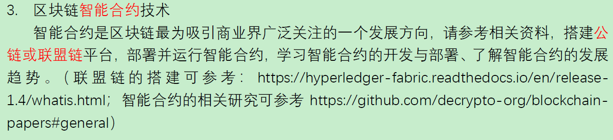

# Computer-Networks
 上海交通大学 计算机网络 SJTU-2020SPRING-EE357

---

使用的教材是：**《计算机网络》、《计算机网络-自顶向下方法》**

第一章习题导航：[Chapter1 Questions]()

---

我们大作业的选题是：

**区块链智能合约技术**

- [联盟链的搭建](https://hyperledger-fabric.readthedocs.io/en/release-1.4/whatis.html)
- [智能合约相关研究](https://github.com/decrypto-org/blockchain-papers#general)