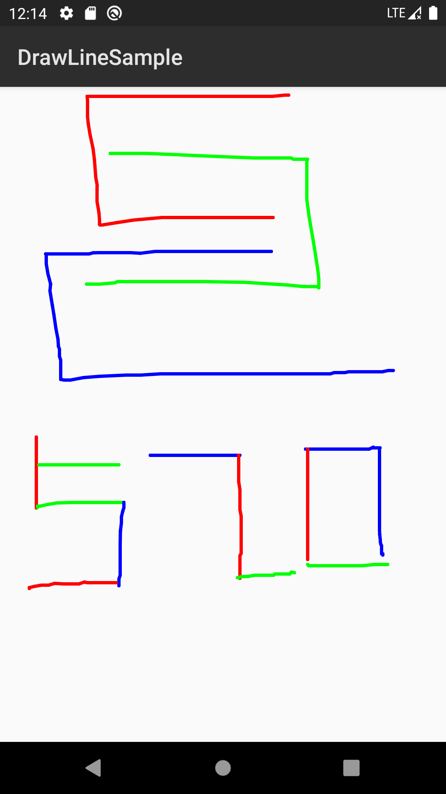
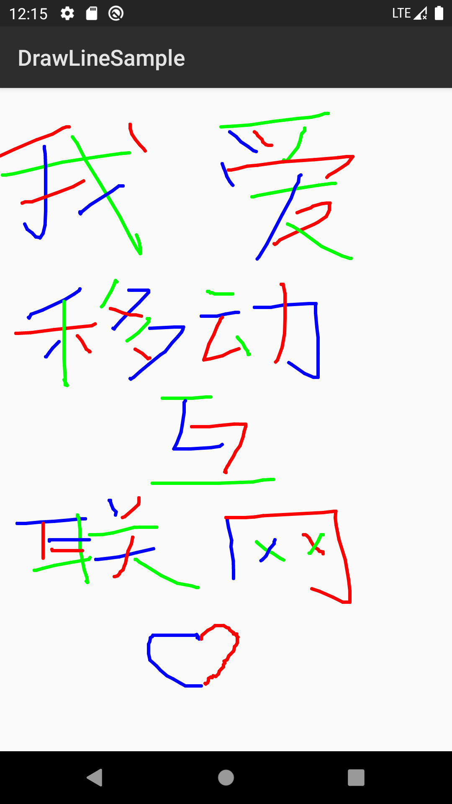

# Lab1 DrawLine

In this Drawline Project, I realize a whiteboard with colorful paints.

1. ACTION_MOVE

   ```java
   canvas.drawLine(x, y, event.getX(), event.getY(), p);
   ```

2. ACTION_DOWN

   ```java
   x = event.getX();
   y = event.getY();
   canvas.drawPoint(x, y, p);
   ```

3. ACTION_UP

   ```java
   switch (time) {
       case 0:
           p.setColor(Color.GREEN);
           break;
       case 1:
           p.setColor(Color.BLUE);
           break;
       case 2:
           p.setColor(Color.RED);
           break;
   }
   time = (time + 1) % 3;
   ```

   switch the color of the painter by time of `Action_Up`.


### Run

You can just open the `DrawLineSample` folder as a android project. 

You may need some time for Android Studio to automatically download relating `jar` for this project.

### Result



