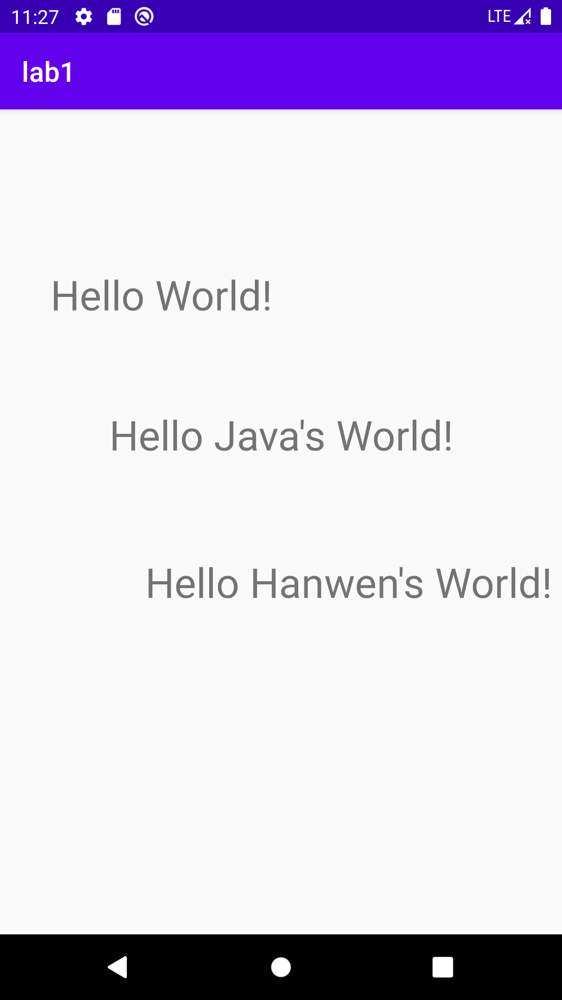

# Lab1 Hello World

In this Hello World Project, I initialize a brand new java program.

1. Find the TextView by id

   ```java
   TextView txtResult = (TextView) findViewById(R.id.txtResult);
   ```

2. And then give the TextView value

   ```java
   txtResult.setText(String.valueOf(text));
   ```

### Run

You can just open the `HelloWorld` folder as a android project. 

### Result

