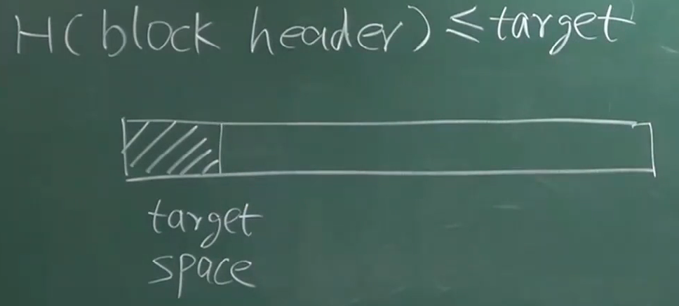

# 02-BTC密码学原理

### Crypto-Currency

区块链上所有的交易都是公开的

# Cryptographic hash function

##### Collision Resistance

- 存在哈希碰撞，没有高效的方法寻找使之哈希碰撞的值
- H(m) 检测是否对之有修改（篡改内容会被检测出来）
- 没有哈希函数能被从数学理论上证明是`Collision Resistance`
- MD5：知道人为如何制造哈希碰撞

##### Hiding

- 哈希函数计算过程是单项不可逆的
  $$
  X -> H(X)
  $$

实现 `Digital Commitment = Digital Equivalent of a sealed envelope`

- 预测结果不能提前公开
- 之后公开 - 容易出现篡改
- **公布哈希值**是一个解决的方案

输入空间足够大，输入空间比较均匀 

-  后面添加一个随机数，让他变成一个输入空间很大的数

##### Puzzle Friendly

事先不知道如何能生成0000000XXXXX的数

挖矿的过程没有捷径 - 工作量的证明

很难找到这个nounce，但是很容易让全网去验证这个nounce

### SHA-256

Secure Hash Algorithm

# 签名

### 账户管理

> 每个用户自己开户，不需要别人批准。

自己创立一个公钥和私钥的对 - (Public Key, Private Key)

来自非对称的加密体系：加密用的公钥，解密使用私钥。

不需要知道对方的私钥，使用对方的公钥加密。

**签名的过程！！！**用我自己的私钥签名，验证签名使用这个人的公钥。

**公钥和私钥**是否会重合？256位的哈希值很难产生相同的公钥和私钥。

产生公钥私钥、签名的时候需要有一个好的随机元。

先对`Message`取哈希，然后对这个哈希值进行签名。

