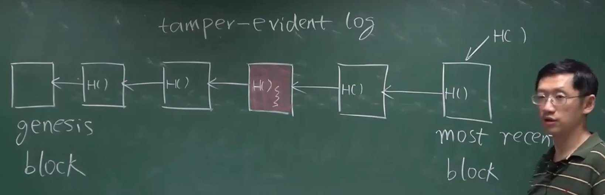
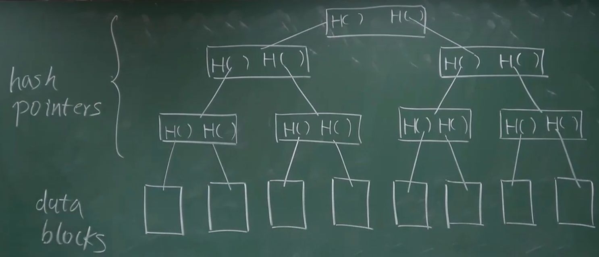
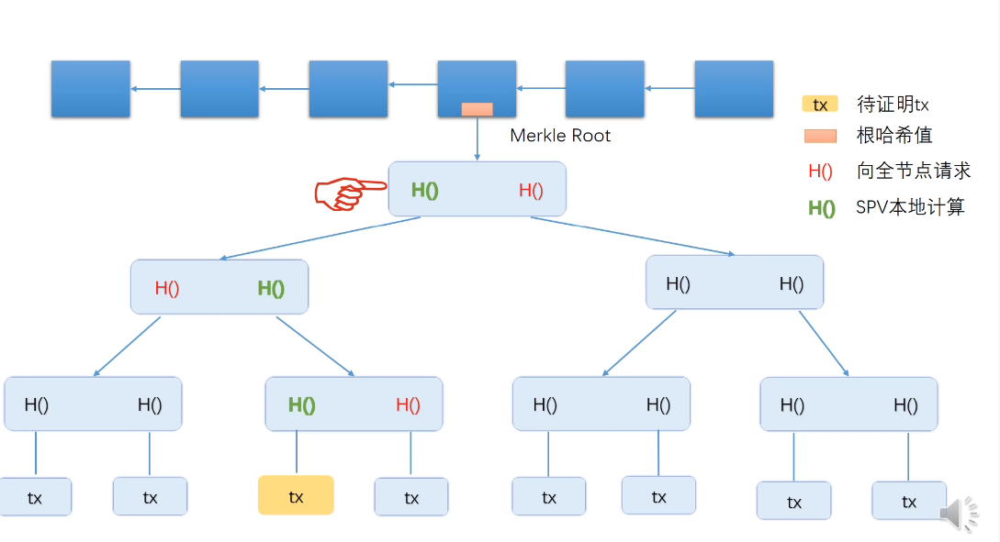

# 03-BTC数据结构

### 哈希指针

`hash pointers` 存储地址和哈希值

区块链和普通的链表的区别：

- 使用哈希指针，代替了普通的指针

只要记住最后的哈希值，就能防范任何位置的修改。

改变其中的任意一个元素，后面所有的区块都会更改。

只用保存最近的区块，可以节约存储。

### Merkle Tree

与 `Binary Tree` 的区别：

- 使用哈希指针代替普通的指针

对于根节点也可以取哈希。

记住根哈希值，就能记住树中任何位置的修改。

和刚才的纯链条形式相比，效率更高。

**比特币中各个区块使用哈希指针连接起来；每个区块所包含的交易组织成Merkle Tree。**

**Merkle Tree**

*Proof of membership / inclusion*——$ O(logn)$

*Proof of non-membership*

- 全部传进来：$O(n)$

- 按照哈希值排序：利用计算值的哈希找到节点$ O(logn)$

  排序的就叫 `Sorted Merkle Tree`