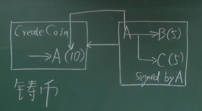
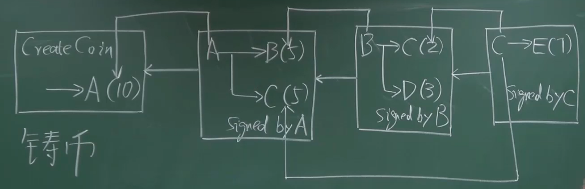
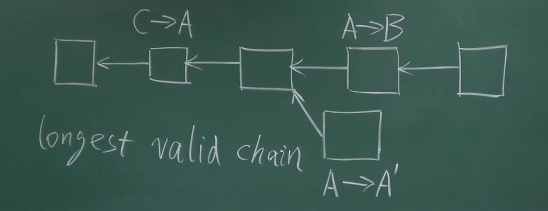

# 04-BTC协议

### 中心化货币

中心化货币：央行发行的人民币。

公私钥体系：非对称的加密体系。

**数字货币：就是文件！**因为有了央行的数字签名，里面的内容不能**伪造**，但是可以**复制！**

**花两次攻击——Double Spending Attack**

央行要维护一个 **编号-所属人** 的表。中心化的交易，需要央行的批准。

---

### 去中心化的货币

- 数字货币的发行——利用挖矿来发行
- 验证交易的有效性——避免``DSA`

所有用户共同维护的数据结构——区块链

铸币交易——凭空发行货币

##### 输入输出

输入部分——币的来源、A的公钥

输出部分——收款人公钥的哈希

##### 两种哈希指针

- 指向前面一个区块
- 指向前面一个交易——说明币的来源 / `DSA`

##### 交易-写到区块链之前

**A需要知道B的地址**（B使用一种方式进行公开）

**B需要知道A的公钥**

- A的签名
- 所有节点都需要知道A的公钥：公钥签名，私钥验证；区块链上，每个节点都独立验证。
- 输入部分需要A的公钥——铸币的时候会有A的哈希。

**加密：**使用接收者的公钥加密，接收者使用自己的私钥解密。

**通过脚本来执行：**输入脚本 + 输出脚本——连在一起运行一下，看看有没有错误。`BitCoin Script`

### Block Chain

##### Block Header

- version(比特币协议的版本)

- hash of previous block header(只算前一个块的块头)
- Merkle Root Hash (验证了Body不能被修改)
- Target（难度预期阈值）- n bits
- Nonce

##### Block Body

Transaction List

##### 分布式的共识

账本的内容取得分布式的共识。

`Distributed Hashtable`

很多的不可能结论：

**FLP impossibility result: **在一个异步的系统（网络时延没有上限）里面，即使只有一个成员是有问题的，也不可能取得共识。

**CAP Theorem: **

- Consistency
- Availability
- Partition Tolerance

分布式系统中只有可能实现两个，不可能都满足。

### Consensus in BitCoin

比特币中有的节点是恶意的。

如果采用投票的方式来进行，因为比特币中良莠不齐`membership`就很难进行判断。

需要接在**最长合法链**上面。

分叉会维持一段时间，然后决出最长合法链。非最长的，就被丢弃掉了（交易撤回）。

我们希望：合法的交易都被记录到区块链中。

##### Block Reward

初块奖励：**铸币交易**

比特币，靠运算能力来投票。

`Hash Rate`

